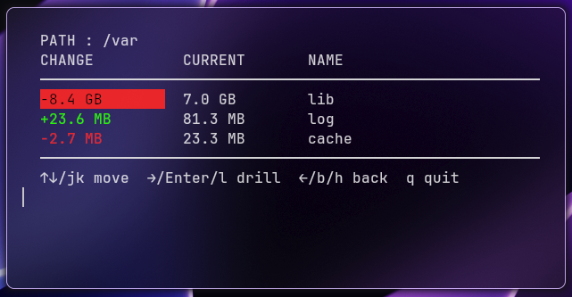

# DeltaSpace

**DeltaSpace** is a _lightweight, zero crate dependency_ **filesystem snapshot and diff explorer** tool for Linux.



## Features

- Scan filesystem and save a snapshot
- Compare snapshots
- Prune snapshots
- TUI for interactive usage
- CLI arguments for programmatic use

## Usage

### Interactive mode

```bash
./deltaspace
```

### CLI mode

```bash
./deltaspace <command> [args]
```

for help, run:

```bash
./deltaspace -h
```

## Performance

Tested on my system, it created a snapshot of ~127k directories in 6.5s.
Compilation time is around <2s due to the absence of dependencies.
