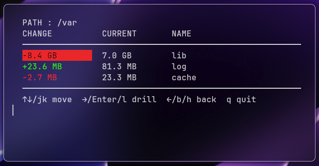

# DeltaSpace

**DeltaSpace** is a _lightweight, zero crate dependency_ **filesystem snapshot and diff explorer** tool for Linux, MacOS and Windows.



## Features

- Scan your entire filesystem and save snapshots
- Compare snapshots in a diff view
- Batch select and delete unwanted directories

## Installation 
You can manually install from [releases](https://github.com/Jarmoco/DeltaSpace/releases) or use [Homebrew](https://brew.sh/):

```bash
brew tap Jarmoco/deltaspace
brew install deltaspace
```

one-liner:
```bash
brew install jarmoco/deltaspace/deltaspace
```

## Usage

### Interactive mode (TUI)

```bash
deltaspace
```

### CLI mode

```bash
deltaspace <command> [args]
```

for help, run:

```bash
deltaspace -h
```

## Automatic Scans

You can schedule automatic filesystem scans using your OS's task scheduler.

### Linux (systemd)

Create a user-level service at `~/.config/systemd/user/deltaspace-scan.service`:

```ini
[Unit]
Description=Run deltaspace scan

[Service]
Type=oneshot
ExecStart=/usr/bin/deltaspace scan
```

Create a timer at `~/.config/systemd/user/deltaspace-scan.timer`:

```ini
[Unit]
Description=Run deltaspace scan every 2 hours

[Timer]
OnCalendar=*-*-* 00/2:00:00
Persistent=true
RandomizedDelaySec=900

[Install]
WantedBy=timers.target
```

Enable lingering (so the timer runs without an active login session) and start the timer:

```bash
sudo loginctl enable-linger $USER
systemctl --user daemon-reload
systemctl --user enable --now deltaspace-scan.timer
```

## Performance

Tested on my system, it created a snapshot of ~130k directories in ~7s on warm filesystem cache, ~35s on cold cache.

## Building

All build dependencies are managed by the `rcc-scripts` submodule.
Just run:

```bash
./rcc-scripts/build.sh
```

More info on the rcc-scripts available [here](https://github.com/Jarmoco/rcc-scripts)

This will create the packages in the `dist/` directory.
